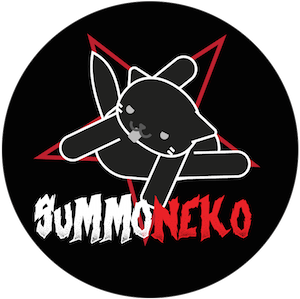

SummoNeko
-----------

Cats and their diabolic plans.

This is a typing game with 2d graphics developed using Unity3d
Made at the *Global Game Jam 2016*, Global BIND Jam, which had "Ritual" as the theme

## Story

It’s a hard life to be a cat.
You purrr, you be cutes, you pets humans… 
=^.^=
But humans no behave as they musts!
x_x
This obviously has a simple solution:
invoking a devil.
[One or two lives might be needed, but we has 9 to spare, right?]
Devils bring food, devils never yell
[“get off that table!”]
And…
Devils are warm.
Mmmm
Prrrr… rrr… rrr…

Now, you want to complete the right invocation moves before your human sees you!

## Build Instructions

This is a Unity3d project, developed using version 5.3.1f1 Personal
Tecnically all you need is to clone this repo and open the resulting folder as an Unity project
Then you may run or build it. We tested builds for OSX, Windows, WebGL and WebPlugin

## How to play

Use your keyboard to follow a sequence of letters and summon a devil before your owner finds out or you run out of time.

## Contributions

The best way to contribute is by trying to play the game. If you managed to play, tell us about your experience. If not, help by explaining us what went wrong. We'll be more than happy to hear from you, as well as helping whenever possible. Just contact any contributor of this project, or fork it as you will.

Pull requests are also welcome. Submit changes or improvements on any part of this project.

## License

This work is licensed under a [Creative Commons Attribution 3.0 International License](http://creativecommons.org/licenses/by-nc-sa/3.0/).
